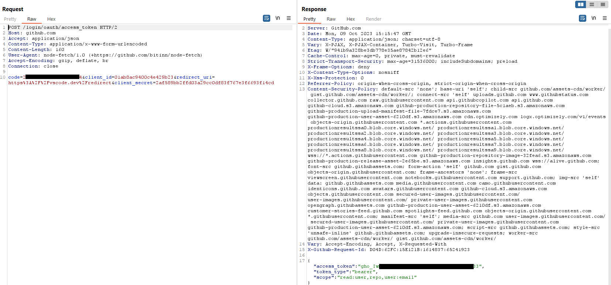

# Spoofing GitHub VSCode extension

GitHub is another great example of a SaaS app that allows for spoofing of legitimate OAuth apps for persistence. Another interesting aspect of GitHub is that sometimes organisations will accept personal developer GitHub accounts into organizations and that this can introduce issues where persistence has been achieved on a personal account that later gains access to private repositories in a GitHub organization. Even if the organization enforces a password change and a new MFA mechanism as part of admittance, OAuth persistence mechanisms can still potentially enable access to the organisation repos to be inherited by attackers who have compromised the account previously.

There are many GitHub apps available but VSCode extensions are one very common example. In fact, the very widely used "GitHub Pull Requests and Issues" extension for VSCode makes use of legacy OAuth access via GitHub instead of the newer GitHub applications mechanism. This is much better for persistence from an attacker’s perspective because up to ten tokens can be valid at the same time before they rotate and tokens last for a minimum of a year without activity. This is documented in GitHub docs:

https://docs.github.com/en/apps/oauth-apps/building-oauth-apps/authorizing-oauth-apps#creating-multiple-tokens-for-oauth-apps
https://docs.github.com/en/authentication/keeping-your-account-and-data-secure/token-expiration-and-revocation#token-expired-due-to-lack-of-use

For example. if an attacker has gained (temporary) access to a GitHub account then they could impersonate this extension to gain persistence. We’ll show this from the perspective of an attacker using their own VSCode instance below to add the extension but using burp to intercept the requests so we can also get access to the raw tokens in order to make custom API calls in future.


*Installing the popular GitHub Pull Requests and Issues extensions*


*Authorizing the GitHub app for this extension to achieve persistence*



*Capturing the client ID, client secret and access token using Burp*

We can see from the requests made that the extension makes use of an embedded client secret as well, so we could actually authorise this app without making use of VSCode but for simplicity we’ve shown it from the perspective of the attacker using their own VSCode instance here. In the response we get the access token and then we can either make use of the embedded functionality within the extension in VSCode for ease, or we can use this token to make custom API calls as shown below:

```
luke@Lukes-MacBook-Pro % curl -H "Authorization: token gho_Iw<REDACTED>33" https://api.github.com/repos/ctrlaltsecure-lab/test/commits
[
  {
    "sha": "0d86e380d86c02776dc67b4e9a426247210b4f4e",
    "node_id": "C_kwDOKWiQ_doAKDBkODZlMzgwZDg2YzAyNzc2ZGM2N2I0ZTlhNDI2MjQ3MjEwYjRmNGU",
    "commit": {
      "author": {
        "name": "Luke Jennings",
        "email": "luke-low-priv@ctrlaltsecure.com",
        "date": "2023-09-26T14:50:20Z"
      },
      "committer": {
        "name": "Luke Jennings",
        "email": "luke-low-priv@ctrlaltsecure.com",
        "date": "2023-09-26T14:50:20Z"
      },
      "message": "test",
      "tree": {
        "sha": "55994856502256b29e955aaabfc28b4fe1c92820",
        "url": "https://api.github.com/repos/ctrlaltsecure-lab/test/git/trees/55994856502256b29e955aaabfc28b4fe1c92820"
      },
```

If the victim does not use the VSCode extension then they may see that a new application has appeared on their account which is suspicious, though it'll still show as a legitimate and common extension at least. However, this is an especially stealthy technique if the target user is already using this extension as it then effectively operates as an [evil twin integration](/techniques/evil_twin_integrations/description.md). 

In this case, the application would already be there from their own legitimate use and there is no way to list the different tokens that are valid for the application. The only way to see there have been multiple tokens created would be to check the security logs. However, new tokens can be created during normal activity where new permissions are requested as a result of extension use and so even that is not that unusual to see. 

We can see the result of this below. In this case, there are now effectively two valid tokens for GitHub for VSCode, one from the legitimate VSCode instance the victim was using and another that we just created as the attacker after an account compromise. However, only one app is listed and it's not possible to see the two different tokens. Revoking the entire app itself, and thus revoking the legitimate user's token too, is the only method to remove the persistence mechanism:

